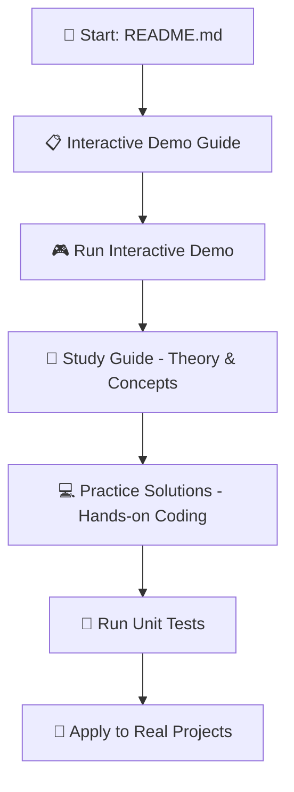

# 🔄 Iterator and Composite Patterns Demo
## Interactive Console Application - Head First Design Patterns

[](https://dotnet.microsoft.com/download/dotnet/8.0)
[](https://docs.microsoft.com/en-us/dotnet/csharp/)
[](https://opensource.org/licenses/MIT)

---

## 📖 **Overview**

This interactive console application demonstrates the **Iterator Pattern** and **Composite Pattern** from the legendary book "Head First Design Patterns" by Eric Freeman & Elisabeth Robson. 

The demo uses a **RTG casino game catalog system** scenario to show how these patterns solve real-world problems in an engaging, educational way, specifically applied to the **RTG gaming industry**.

---

## 🎓 **Learning Resources & Navigation**

### 📚 **Start Your Learning Journey Here:**

| 📖 **Resource** | 🎯 **Purpose** | 👥 **Best For** |
|-----------------|----------------|------------------|
| **[📋 Interactive Demo Guide](IteratorCompositeDemo/INTERACTIVE_DEMO_GUIDE.md)** | Complete walkthrough of the interactive demo features, presentation tips, and educational benefits | Teachers, presenters, workshop leaders |
| **[📘 Study Guide (Spanish)](Guia_Estudio_Iterator_Composite_Gaming_ES.md)** | Comprehensive study guide covering theory, concepts, MCQs, and practical exercises adapted to RTG casino gaming | Students, self-learners, exam preparation |
| **[💻 Practice Solutions](CSharp_Practice_Solutions.cs)** | Ready-to-run C# code examples with complete implementations of both patterns in RTG casino context | Developers, coding practice, reference implementations |

### 🚀 **Recommended Learning Path:**


1. **📋 [Interactive Demo Guide](IteratorCompositeDemo/INTERACTIVE_DEMO_GUIDE.md)** - Start here to understand what the demo offers
2. **🎮 Run the Demo** - Experience the patterns in action (`dotnet run`)
3. **📘 [Study Guide](Guia_Estudio_Iterator_Composite_Gaming_ES.md)** - Deep dive into theory and concepts
4. **💻 [Practice Solutions](CSharp_Practice_Solutions.cs)** - Implement and experiment with the code
5. **🧪 Run Tests** - Validate your understanding (`dotnet test`)

---

## 🎯 **What You'll Learn**
- **Iterator Pattern**: Uniform access to different collection types
- **Composite Pattern**: Building and managing tree structures  
- **Pattern Synergy**: How these patterns work beautifully together
- **Real-World Application**: Practical examples you can apply immediately in RTG gaming industry

---

## ✨ **Features**

### 🎮 **Interactive Learning Experience**
- **Step-by-step progression** with user-controlled pacing
- **Problem-first approach** - see why patterns matter before learning how
- **Live code examples** embedded directly in the console
- **Color-coded output** for enhanced visual learning
- **Professional presentation mode** perfect for teaching

### 🏗️ **Complete Pattern Implementation**
- **Iterator Pattern**: List-based and Array-based collections with uniform access
- **Composite Pattern**: Nested game category hierarchies with recursive operations
- **Real Working Code**: Full implementations, not just pseudocode
- **Clean Architecture**: Well-structured, testable code following SOLID principles

### 📚 **Educational Excellence**
- **19 Comprehensive Unit Tests** (100% pass rate)
- **Self-contained demo** - no external dependencies needed
- **Presentation-ready** - perfect for workshops, conferences, and classrooms
- **Head First Design Patterns alignment** - matches the book's teaching methodology

---

## 🚀 **Quick Start**

### **Prerequisites**
- [.NET 8 SDK](https://dotnet.microsoft.com/download/dotnet/8.0)
- Any IDE or text editor (Visual Studio, VS Code, JetBrains Rider)

### **Running the Demo**
```bash
# Clone or download the repository
cd IteratorCompositeDemo

# Run the interactive demo
dotnet run

# Run the unit tests  
dotnet test
```

### **What to Expect**
The demo will guide you through:
1. **Welcome & Introduction** - Learning objectives and setup
2. **The Problem** - Why we need these patterns (with bad code examples)
3. **Iterator Pattern Solution** - Uniform collection access in action
4. **Composite Pattern Solution** - Tree structure handling elegantly
5. **Final Summary** - Key takeaways and real-world applications

---

## 📁 **Project Structure**

```
IteratorCompositeDemo/
├── 📋 INTERACTIVE_DEMO_GUIDE.md    # 📖 Complete demo walkthrough
├── 📘 Guia_Estudio_*.md           # 📚 Study guides and theory
├── 💻 CSharp_Practice_Solutions.cs # 🔧 Practice code examples
├── Iterator/                       # Iterator Pattern Implementation
│   ├── IIterator.cs               # Iterator interface
│   ├── IAggregate.cs              # Aggregate interface  
│   ├── CasinoGame.cs              # Basic casino game
│   ├── SlotsCatalog.cs            # List-based collection
│   ├── SlotsIterator.cs           # Iterator for List<T>
│   ├── TableGamesCatalog.cs       # Array-based collection
│   └── TableGamesIterator.cs      # Iterator for Array
├── Composite/                      # Composite Pattern Implementation
│   ├── GameComponent.cs           # Component base class
│   ├── CasinoGame.cs              # Leaf implementation
│   ├── GameCategory.cs            # Composite implementation
│   ├── CompositeIterator.cs       # Tree traversal iterator
│   └── GameManager.cs             # Client class
├── Program.cs                     # Interactive demo entry point
└── Tests/                         # Comprehensive test suite
    ├── IteratorTests.cs           # Iterator pattern tests
    ├── CompositeBehaviorTests.cs  # Composite behavior tests
    ├── CompositeIteratorTests.cs  # Tree traversal tests
    └── GameManagerTests.cs        # Integration tests
```

---

## 🔧 **Pattern Implementations**

### 🔄 **Iterator Pattern**
Provides uniform access to different collection types without exposing internal structure.

**Key Classes:**
- `IIterator<T>` - Defines iteration interface
- `SlotsCatalog` - Uses `List<T>` internally
- `TableGamesCatalog` - Uses `Array` internally
- Both provide the same iteration experience!

### 🌳 **Composite Pattern**  
Composes objects into tree structures and treats individual objects and compositions uniformly.

**Key Classes:**
- `GameComponent` - Base component for uniform treatment
- `CasinoGame` - Leaf nodes (individual casino games)
- `GameCategory` - Composite nodes (game category containers)
- `GameManager` - Client that works with entire hierarchy

---

## 🎤 **Perfect for Presentations**

### 🎯 **For Speakers/Trainers**
> 👉 **Start with:** [📋 Interactive Demo Guide](IteratorCompositeDemo/INTERACTIVE_DEMO_GUIDE.md) for presentation tips

- **Single window experience** - no IDE switching needed
- **Built-in code examples** - patterns displayed in console
- **Interactive pacing** - audience can follow along
- **Professional appearance** - clean, bordered code blocks
- **Complete coverage** - theory + practical implementation

### 👥 **For Audiences**
- **Clear learning progression** - problem → solution → benefits
- **Real working code** - see actual implementations
- **Interactive engagement** - active participation required
- **Memorable experience** - visual and interactive elements
- **Reference material** - everything needed in one demo

---

## 🎓 **Educational Use Cases**

| Setting | Benefits | Recommended Resource |
|---------|----------|---------------------|
| **🏫 University Courses** | Interactive classroom demos, homework reference | [📋 Demo Guide](IteratorCompositeDemo/INTERACTIVE_DEMO_GUIDE.md) + [💻 Practice Code](CSharp_Practice_Solutions.cs) |
| **🏢 Corporate Training** | Professional development, team workshops | [📘 Study Guide](Guia_Estudio_Iterator_Composite_Gaming_ES.md) |
| **🎤 Conference Talks** | Live demos, audience engagement | [📋 Demo Guide](IteratorCompositeDemo/INTERACTIVE_DEMO_GUIDE.md) |
| **📖 Self Study** | Accompanies Head First Design Patterns book | [📘 Study Guide](Guia_Estudio_Iterator_Composite_Gaming_ES.md) |
| **🤝 Meetups & Workshops** | Hands-on learning, group discussions | All resources combined |

---

## 🧪 **Testing**

The project includes a comprehensive test suite with **19 tests** covering:

- **Iterator Pattern Edge Cases** - Empty collections, capacity limits, multiple iterators
- **Composite Pattern Behavior** - Tree traversal, recursive operations, nested structures  
- **Integration Scenarios** - Patterns working together, client code usage
- **Error Handling** - Proper exception throwing and boundary conditions

```bash
# Run all tests
dotnet test

# Run with detailed output
dotnet test --verbosity normal

# Run specific test class
dotnet test --filter "ClassName=IteratorTests"
```

---

## 🎯 **Key Learning Outcomes**

After running this demo, you'll understand:

### **Iterator Pattern**
- ✅ **Uniform Access** - Same interface for different collections
- ✅ **Encapsulation** - Internal structure hidden from clients  
- ✅ **Extensibility** - Easy to add new collection types
- ✅ **Single Responsibility** - Iteration logic separated from business logic

### **Composite Pattern**  
- ✅ **Tree Structures** - Elegant handling of hierarchical data
- ✅ **Uniform Treatment** - Same operations on leaves and composites
- ✅ **Recursive Operations** - Operations propagate through entire tree
- ✅ **Client Simplicity** - Client doesn't need to distinguish node types

### **Pattern Synergy**
- ✅ **Combined Power** - Iterator traverses Composite structures beautifully
- ✅ **Real-World Application** - Practical scenarios in RTG gaming industry
- ✅ **Design Principles** - Open/Closed Principle, Single Responsibility
- ✅ **Best Practices** - Clean, maintainable, extensible code

---

## 🎰 **RTG Casino Gaming Industry Application**

This demo is specifically tailored for the **RTG gaming industry**, demonstrating how these patterns solve real problems in:

### **Game Catalog Management**
- **RTG Game Series** - Different RTG series use different data structures
- **Category Hierarchies** - Slots, Table Games, Live Casino with subcategories
- **Promotional Games** - Special categories for bonus games and promotions
- **RTP Filtering** - Easy filtering of games by Return to Player percentage

### **Real RTG Games Featured**
- **Doragon's Gems** - Features: Cascading Wins, Free Games With Gamble Option, Buy Feature, Bonus Bets
- **Whispers of Seasons** - Japanese-themed slot with expanding wilds
- **Plentiful Treasure** - Asian treasure slot
- **Spirit of the Inca** - Progressive slot with millionaire jackpot
- **Alien Wins** - Slot with daily free spins (Promotional)
- **Horseman Prize** - The Haunted Ride of Free Games (Promotional)
- **Fu Long Plinko** - Bonus Drops for free tokens (Promotional)

### **Real-World Scenarios**
- **Slots Catalog** - Uses `List<T>` for dynamic RTG game additions
- **Table Games Catalog** - Uses `Array` for fixed capacity management
- **Live Casino** - Nested categories for different dealer studios
- **Promotional Games** - Nested subcategories within slots

---

## 📖 **Based on Head First Design Patterns**

This demo closely follows the examples and teaching methodology from the acclaimed book:

> **"Head First Design Patterns: Building Extensible & Maintainable Object-Oriented Software"**  
> *By Eric Freeman & Elisabeth Robson with Kathy Sierra & Bert Bates*

### 📚 **Chapter Coverage**
- **Chapter 9**: "The Iterator and Composite Patterns: Well-Managed Collections"
- **RTG Casino Game System** - Adapted from the restaurant menu scenario
- **Progressive Learning** - Problem identification → Pattern application → Benefits
- **Real-World Context** - RTG gaming industry scenarios

---

## 🤝 **Contributing**

This is an educational project! Feel free to:

- **🐛 Report Issues** - Found a bug or have a suggestion?
- **💡 Suggest Improvements** - Ideas for better explanations or examples?
- **📝 Add Documentation** - Help make it even more educational
- **✨ Enhance Features** - Additional patterns or interactive elements

---

## 📄 **License**

This project is licensed under the MIT License - see the [LICENSE](LICENSE) file for details.

---

## 🙏 **Acknowledgments**

- **Head First Design Patterns** team for the excellent educational methodology
- **Gang of Four** for the original design patterns catalog  
- **.NET Community** for the amazing development platform
- **Open Source Community** for inspiration and best practices

---

## 📚 **Additional Resources**

### **📖 Recommended Reading**
- [Head First Design Patterns (2nd Edition)](https://www.oreilly.com/library/view/head-first-design/9781492078807/)
- [Design Patterns: Elements of Reusable Object-Oriented Software](https://www.amazon.com/Design-Patterns-Elements-Reusable-Object-Oriented/dp/0201633612)

### **🔗 Related Links**
- [.NET 8 Documentation](https://docs.microsoft.com/en-us/dotnet/)
- [C# Design Patterns](https://docs.microsoft.com/en-us/dotnet/standard/design-guidelines/)
- [Iterator Pattern (Microsoft Docs)](https://docs.microsoft.com/en-us/dotnet/api/system.collections.ienumerator)

### **📋 Educational Materials in This Repository**
- **[📋 Interactive Demo Guide](IteratorCompositeDemo/INTERACTIVE_DEMO_GUIDE.md)** - Complete feature guide and usage instructions
- **[📘 Study Guide (Spanish)](Guia_Estudio_Iterator_Composite_Gaming_ES.md)** - Comprehensive theory and practice guide
- **[💻 Practice Solutions](CSharp_Practice_Solutions.cs)** - Hands-on coding examples and exercises

---

**🎉 Happy Learning! Transform your understanding of Iterator and Composite Patterns through this engaging, interactive RTG casino gaming experience!** 🚀

---

*Built with ❤️ for the developer community • Perfect for presentations, education, and hands-on learning in the RTG gaming industry*